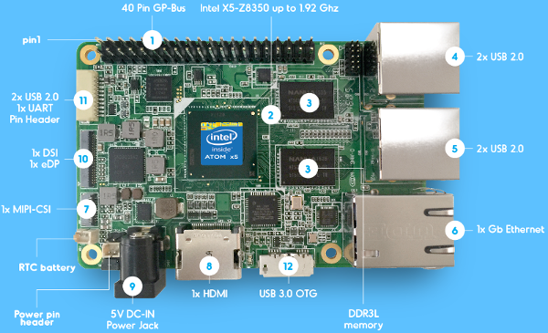
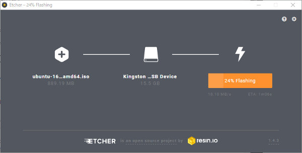
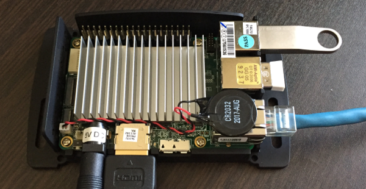
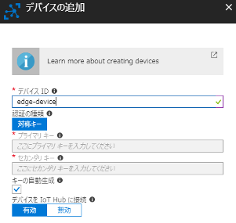
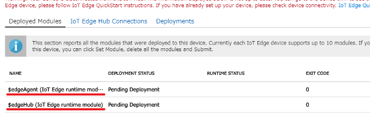
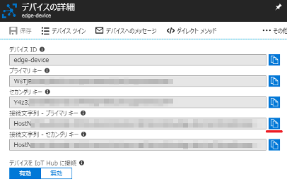

#### IoT Edge v2にモノ（リーフデバイス）を接続してみよう！ ([目次](readme.md))

# IoT Edgeをセットアップ


UPボードにLinuxをインストールして、IoT Edgeランタイムをインストール、起動します。  
Linuxインストールは、（USBメモリにLinuxを入れておいて）USBメモリから起動して、eMMCへインストールします。
その後、UPボード用のLinuxカーネルをインストール、IoT Edgeランタイムをインストールし、IoT Hubへの接続情報を設定してからIoT Edgeを起動します。

> UPボードとは、台湾のAAEON社が開発したシングルボードコンピュータで、Intel Atom x5 CPUと1GB/2GB/4GBのメモリ、16GB/32GB/64GB eMMCを搭載しており、他のシングルボードコンピュータと比べて高速に処理を実行することができます。  
>   
> ([UPボードのWebサイト](http://www.up-board.org/up/)から引用)

## インストールUSBメモリを作成

UPボードでUSB起動するのに使用するUSBメモリを作成します。

1. [Ubuntu 16.04.4 LTS (Xenial Xerus)](http://releases.ubuntu.com/16.04/)から、`ubuntu-16.04.4-server-amd64.iso`をダウンロードします。
1. [Etcher](https://etcher.io/)の下の方にある、`Etcher for Windows x64 (64-bit) (Portable)`(Etcher-Portable-1.4.4-x64.exe)をダウンロードします。
1. パソコンにUSBメモリを取り付けます。
1. Etcher-Portable-1.4.4-x64.exeを起動して、ubuntu-16.04.4-server-amd64.isoをUSBメモリに書き込みます。
> 起動時に「WindowsによってPCが保護されました」が表示されたときは、詳細情報をクリックして、実行ボタンをクリックしてください。



## 周辺機器を接続

UPボードにインストールUSBメモリとUSB日本語キーボード、LANケーブル、HDMIケーブル、ディスプレイを接続します。

1. UPボードにHDMIケーブルでディスプレイを接続します。
2. UPボードにLANケーブルを接続します。
3. UPボードに日本語キーボードを接続します。
4. UPボードにインストールUSBメモリを接続します。

写真ではDC5Vも接続していますが、、、**この時点ではDC5Vは未だ接続しないでください。**

> 無線式キーボードを使用したので、写真にはUSBレシーバーが写っています。



## Linuxをインストール

UPボードでインストールUSBメモリから起動して、eMMCへLinuxをインストールします。
その後、UPボード用のLinuxカーネルをインストールします。

### USBメモリから起動してLinuxをインストール

1. DC 5Vを接続した後、Please select boot device画面が表示されるまでキーボードの`F7`キーを連打します。
1. **Please select boot device画面** `Enter Setup`を選択します。
1. **Enter Password画面** 文字を入力せず`Enter`キーを押します。
1. **Aptio Setup Utility画面** Save & Exitタブにある`Restore Defaults`を実行します。
1. **Aptio Setup Utility画面** Save & Exitタブにある`Save Changes and Reset`を実行します。
1. 再起動するので、Please select boot device画面が表示されるまでキーボードの`F7`キーを連打します。
1. **Please select boot device画面** `USBメモリ(UEFI: xxxx)`を選択します。
1. **GNU GRUB画面** `Install Ubuntu Server`を選択します。
1. **Select a language画面** `English - English`を選択します。
1. **Select your locaton画面** `other` -> `Asia` -> `Japan`を選択します。
1. **Confgure locales画面** `United States - en_US.UTF-8`を選択します。
1. **Configure the keyboard画面** `No` -> `Japanese` -> `Japanese`を選択します。
1. **Configure the network画面** 変更せず`Enter`キーを押します。（ホスト名="ubuntu"）
1. **Set up users and passwords画面** 新しく作る名前とアカウントとパスワード（2回入力）を入力します。
1. **Set up users and passwords画面** ホームディレクトリの暗号化(Encrypt your home directory?)は、`No`を選択します。
1. **Configure the clock画面** `Yes`を選択します。
1. **Partition disks画面** `Guided - use entire disk and set up LVM`を選択します。
1. **Partition disks画面** ディスクは、`MMC/SD card #1 (mmcblk0)`を選択します。
1. **Partition disks画面** データを削除しても良いか(Remove existing logical volume data?)聞かれたときは、`Yes`を選択します。
1. **Partition disks画面** LVM設定を変更しても良いか(Write the changes to disks and configure LVM?)は、`Yes`を選択します。
1. **Partition disks画面** ディスク使用量は、変更せず`Enter`キーを押します。
1. **Partition disks画面** UEFIインストールするか(Force UEFI installation?)聞かれたときは、`Yes`を選択します。
1. **Partition disks画面** ディスクを書き換えるか(Write the changes to disks?)聞かれたときは、`Yes`を選択します。
1. USBメモリからeMMCにシステムイメージがコピーされます。
1. **Configure the package manager画面** HTTPプロキシは、文字を入力せず`Enter`キーを押します。
1. **Configuring tasksel画面** `No automatic updates`を選択します。
1. **Software selection画面** 変更せず`Enter`キーを押します。
1. eMMCにソフトウェアがコピーされます。
1. **Finish the installation画面** UPボードからインストールUSBメモリを取り外して、`Enter`キーを押します。

### SSHサーバーをインストール(オプション)

パソコンからターミナルソフトでSSH接続できるようにSSHサーバーをインストールします。
テキストからコピー&ペーストができるようになるので便利です。

```bash
sudo apt update
sudo apt install openssh-server
```
### パッケージを最新に更新

```bash
sudo apt update
sudo apt full-upgrade -y
sudo reboot
```

### UPボード用のLinuxカーネルをインストール

```bash
sudo add-apt-repository ppa:ubilinux/up
sudo apt update
sudo apt-get autoremove --purge 'linux-.*generic'
sudo apt-get install linux-image-generic-hwe-16.04-upboard
sudo reboot
```

`uname -srv`で下記のように表示されれば正常です。

```bash
$ uname -srv
Linux 4.10.0-42-generic #5000~upboard10-Ubuntu SMP Tue Dec 19 12:58:48 UTC 2017
```

## IoT Edgeランタイムをインストール

IoT Edgeランタイムに必要なパッケージをインストール、アップグレードして、IoT Edgeランタイムをインストールします。

### pipをインストール

```bash
sudo apt-get update
sudo apt-get install python-pip
sudo -H pip install -U pip
```

### setuptoolsなどを最新に更新

```bash
sudo apt-get install python2.7-dev libffi-dev libssl-dev
sudo -H pip install -U setuptools cryptography idna
```

### Dockerをインストール

```bash
curl -fsSL get.docker.com -o get-docker.sh
sudo sh get-docker.sh
sudo usermod -aG docker ubuntu
```
**usermodコマンドのubuntuの部分**はアカウント名です。Linuxインストール時に指定したアカウント名に変更してください。


設定変更を反映するためにログアウトして、再ログオンします。

```bash
exit
```

### IoT Edgeランタイムをインストール

```bash
sudo -H pip install -U azure-iot-edge-runtime-ctl
```

## IoT HubにIoT Edgeを追加

1. IoT HubのIoT Edgeにある`Add IoT Edge Device`を選択し、デバイスIDを入力して`保存`をクリックします。  

1. 追加したIoT Edgeのデバイスの詳細画面で、`Set Modules`を選択し、`Next` -> `Next` -> `Submit`をクリックします。
すると、Deployed ModulesにedgeAgentとedgeHubが追加されます。  

1. IoT Edgeの接続文字列をコピーして、メモ帳などに貼り付けておきます。(オプション)  


## IoT Edgeランタイムを起動

```bash
sudo iotedgectl setup --auto-cert-gen-force-no-passwords --connection-string "IoT Edgeの接続文字列"
sudo iotedgectl start
```
**IoT Edgeの接続文字列**はIoT Hubに追加したIoT Edgeの接続文字列です。

しばらくして、IoT Hubに追加したIoT Edgeのデバイスの詳細画面にあるedgeAgentとedgeHubのRUNTIME STATUSが`running`と表示されれば正常です。  


## (参考)

* [UP specifications](http://www.up-board.org/up/specifications/)
* [UP shop](https://up-shop.org/)
* [Install Ubuntu for UP, UP2, UP Core](https://wiki.up-community.org/Ubuntu)
* [Ubuntu 16.04.4 LTS (Xenial Xerus)](http://releases.ubuntu.com/16.04/)
* [Etcher](https://etcher.io/)
* [OpenSSH Server](https://help.ubuntu.com/lts/serverguide/openssh-server.html)
* [Quickstart: Deploy your first IoT Edge module to a Linux or Mac device - preview](https://docs.microsoft.com/en-us/azure/iot-edge/quickstart-linux)
* [Get Docker CE for Ubuntu](https://docs.docker.com/install/linux/docker-ce/ubuntu/#install-using-the-convenience-script)
